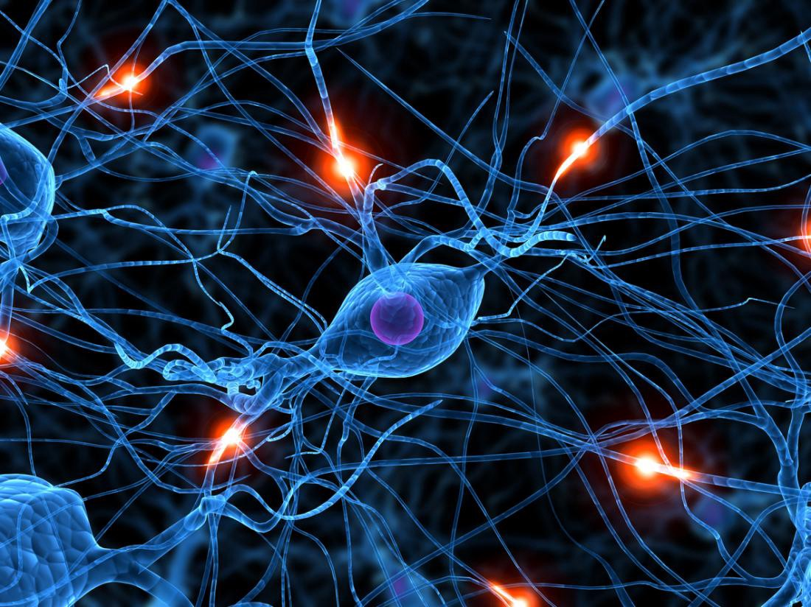
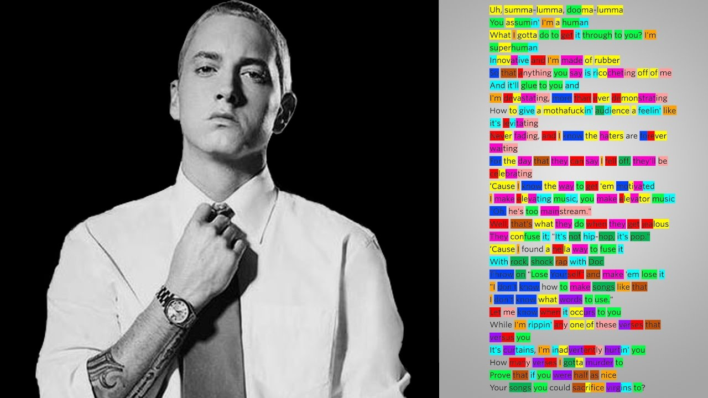
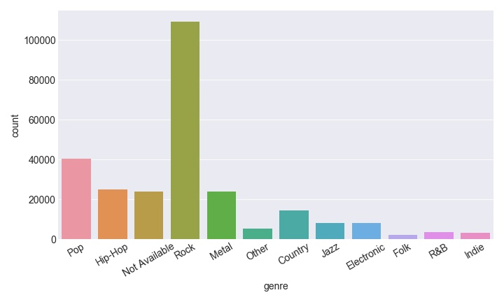
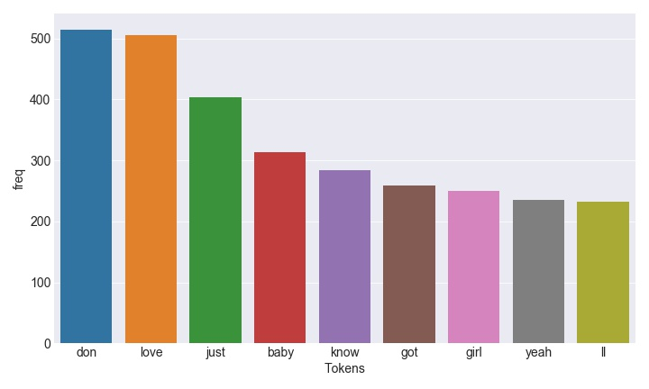
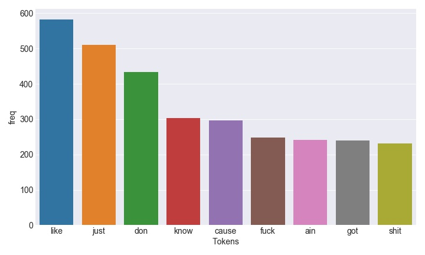
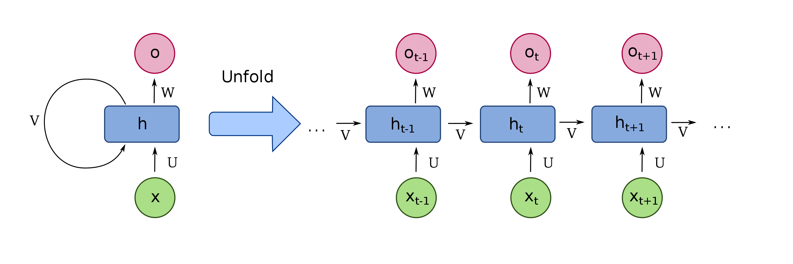
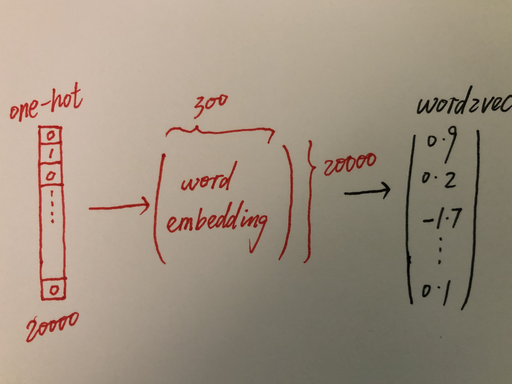

# Lyrics generator

## Table of Contents

<!-- vim-markdown-toc GFM -->

* [Introduction](#introduction)
    * [1. Motivation](#1-motivation)
    * [2. Exploratory data analysis](#2-exploratory-data-analysis)
        * [Bag-of-words](#bag-of-words)
* [Character-level recurrent neural network(RNN)](#character-level-recurrent-neural-networkrnn)
    * [1. How to prepare the data and train the model?](#1-how-to-prepare-the-data-and-train-the-model)
    * [2. How to generate lyrics? Teacher forcing](#2-how-to-generate-lyrics-teacher-forcing)
    * [3. Eminem's lyrics generator](#3-eminems-lyrics-generator)
* [Word-level RNN](#word-level-rnn)
    * [1. Word embedding and word2vec](#1-word-embedding-and-word2vec)
    * [2. Michael Jackson's lyrics generator based on word-level RNN](#2-michael-jacksons-lyrics-generator-based-on-word-level-rnn)
    * [3. How to improve word-level model?](#3-how-to-improve-word-level-model)
        * [a. Using pretrained word embedding](#a-using-pretrained-word-embedding)
        * [b. Word-level seq2seq model](#b-word-level-seq2seq-model)
* [Concluding remarks](#concluding-remarks)
* [Reference](#reference)
* [Acknowledgement](#acknowledgement)

<!-- vim-markdown-toc -->

## Introduction

### 1. Motivation

Natural language processing is among the most attractive and difficult field in machine learning. Different from computer vision and other machine learning tasks, NLP does not convey meaning through any physical manifestation. By the virtue of deep learning, NLP achieved tremendous progress in keyword search, machine translation, semantic analysis and etc. In this project, I would like to make a lyrics generator by using both character level and word level RNN(recurrent neural network).


Neural network                        | Lyric generator
:-------------------------:           | :-------------------------:
</img> | </img>

The dataset is from kaggle with 3.8 million song lyrics from various artist.

| index | song            | year | artist  | genre | lyrics                                            |
|-------|-----------------|------|---------|-------|---------------------------------------------------|
| 0     | ego-remix       | 2009 | beyonce | Pop   | Oh baby, how you doing?\nYou know I'm gonna cu... |
| 1     | then-tell-me    | 2009 | beyonce | Pop   | playin' everything so easy,\nit's like you see... |
| 2     | honesty         | 2009 | beyonce | Pop   | If you search\nFor tenderness\nIt isn't hard t... |
| 3     | you-are-my-rock | 2009 | beyonce | Pop   | Oh oh oh I, oh oh oh I\n[Verse 1:]\nIf I wrote... |
| 4     | black-culture   | 2009 | beyonce | Pop   | Party the people, the people the party it's po... |



But I will only use lyrics from Eminem and Michael Jackson. Because they have around 400 songs, it is easier to extract regular patterns from them.

### 2. Exploratory data analysis

Unlike other machine learning tasks, there is not much visualization we can do with NLP. And data cleaning will be based on the model that we want to explore. For character-based model, it is necessay to keep punctuations as they are part of the characters. However, for word-based model, punctuations are supposed to be removed. To briefly explore the dataset, we will count most frequently used words for different artists (bag of words or unigram). Consequently, very crude sentiment score can be obtained from it.

#### Bag-of-words
Remove stop words and punctuations from lyrics
```python
from sklearn.feature_extraction.text import CountVectorizer

vectorizer = CountVectorizer(stop_words='english')
X = vectorizer.fit_transform([eminem_lyrics])
```

Sentiment score base on bag-of-words
```python
from nltk.sentiment.vader import SentimentIntensityAnalyzer

def sentiment(eminem_lyrics):
    sentiment = SentimentIntensityAnalyzer()
    score = sentiment.polarity_scores(eminem_lyrics)
    return score
```

Michael Jackson                   | Eminem
:-------------------------:       | :-------------------------:
</img> | </img>
sentiment score: 1.0              | sentiment score: -1.0

Based on bag of words, one can do naive bayes to predict the genre of songs, but we will not cover it here. Let us go deeper to deep learning.


## Character-level recurrent neural network(RNN)

Why recurrent? Different from vanilla neural network, RNN (see below, pic from wikipedia) is able to process sequences of inputs (such as words and sentences) by utilizing the internel state (memory state). Hence, it is regarded as a very promising candidate to solve NLP tasks.



Inspired by the [minimal character-level Vanilla RNN model](https://gist.github.com/karpathy/d4dee566867f8291f086) from Andrej Karpathy, we decided to build a more complicated RNN model to generate lyrics. Below is the summary of my model: 2 LSTM layers and 1 dense layer.
```
Layer (type)                 Output Shape              Param #   
=================================================================
lstm_1 (LSTM)                (None, 10, 200)           230400    
_________________________________________________________________
dropout_1 (Dropout)          (None, 10, 200)           0         
_________________________________________________________________
lstm_2 (LSTM)                (None, 200)               320800    
_________________________________________________________________
dropout_2 (Dropout)          (None, 200)               0         
_________________________________________________________________
dense_1 (Dense)              (None, 87)                17487     
=================================================================
Total params: 568,687
Trainable params: 568,687
Non-trainable params: 0
_________________________________________________________________
```
After 600 epochs, the model achieved 64% accuracy for validation set.
```
Epoch 600/600 - loss: 0.7529 - acc: 0.7858 - val_loss: 1.6630 - val_acc: 0.6402
```

### 1. How to prepare the data and train the model?

* One-hot encode all characters ( a-z, 0-9 and punctuations ``` !"#$%&()*+,-./:;<=>?@[\\]^_`{|}~\t\n ``` )
    ```python
    from keras.utils import to_categorical

    one-hot_X = to_categorical(X, num_classes=vocab_size)

    [1,2,3] -> [[1,0,0], [0,1,0], [0,0,1]]
    ```
* Make a sliding window that collects 10 characters as input. Model only generates one character.
    ```
    input: 'hello, world' -> output: 'n', true output: 'p'
    ```
* Calculate cross entropy and backpropagate the neural network to update 568,687 parameters.
* Slide the window to the right by one character. Extract new input and iterate above process until cost function reaches the minimum.


### 2. How to generate lyrics? Teacher forcing

* Make seed lyrics. Feed it to the neural network to generate one character after the seed lyrics, 'b'.
    ```
    input: 'I want to ' -> output 'b'
    ```
* Append new character to the seed lyrics and remove the very first character.
    ```
    new input : ' want to b'
    ```
* Feed the new seed lyrics into the neural network and iterate the above process as many as you want.
    ```
    'I want to ' -> ' want to b' -> 'want to be' -> .... -> 'ing of pop'
    ```
* In the end, you might get something like 'I want to be king of pop'

This process is known as teacher forcing: training neural network that uses model output from a prior time step as an input.


### 3. Eminem's lyrics generator

After one epoch, generated lyrics:
```
input: 'not afraid'    output: 'the me the me the me the me the me the me the me the me the'
```
After 600 epochs, generated lyrics:
```
20 characters
input: 'slim shady'    output: '(what you was a mom'

40 characters
input: "i'm rap go"    output: "ing, you should see her, she won't even"

60 characters
input: 'the way i'    output: "lounding off, they can try to take your heart and I don't kn"

80 characters
input: 'lose myself'    output: ' in the music, the moment You own it, you better never let it go You only get o'

100 characters
input: 'not afraid' output: ') To take a stand) Maybe a dontte the back of the way that I know what the fuck I say to the motherf'
```


## Word-level RNN

### 1. Word embedding and word2vec

Instead of letting the model learning how to spell words. One can upgrade the model from character-level to word-level. Correspondingly, this endows model the ability to learning semantics from the corpus. Since the number of unique words is much larger than that of characters, it is necessay to introduce a new representation: word embedding. This is basically the only difference from character-based model. However, there is much more wisdom than just dimension reduction. The notion was first referred by [Misolov, et al.,2013](https://arxiv.org/pdf/1310.4546.pdf). Word embedding rotates word vector from one-hot representation to word2vec representation.



```
_________________________________________________________________
Layer (type)                 Output Shape              Param #
=================================================================
embedding_1 (Embedding)      (None, 10, 100)           600500
_________________________________________________________________
lstm_1 (LSTM)                (None, 10, 300)           481200
_________________________________________________________________
dropout_1 (Dropout)          (None, 10, 300)           0
_________________________________________________________________
lstm_2 (LSTM)                (None, 300)               721200
_________________________________________________________________
dropout_2 (Dropout)          (None, 300)               0
_________________________________________________________________
dense_1 (Dense)              (None, 300)               90300
_________________________________________________________________
dense_2 (Dense)              (None, 6005)              1807505
=================================================================
Total params: 3,700,705
Trainable params: 3,700,705
Non-trainable params: 0
_________________________________________________________________
```
Training is much harder than character-base model. Only 32% accuracy is obtained from this model.
```
Epoch 300/300 - loss: 2.1268 - acc: 0.7121 - val_loss: 8.1230 - val_acc: 0.3291
```


### 2. Michael Jackson's lyrics generator based on word-level RNN

After 300 epochs:
```
20-word: here to change the world hee were afraid that away when we change my hand verse ill can never change
my heart in pieces lost my heart on the carousel to

40-word: a circus girl who left my heart in pieces lost my heart on the carousel to a circus girl who left my heart in pieces lost my heart on the carousel to a circus girl who left my heart in
just a little bit baby thats all i need thats all

60-word: night need you dont understand you need what about hard let me change you comes your truth out and to guess down together together then be her day every thing out the carpet were gonna see this one understand by much then ever so to see you there are long so game if let me get away verse verse cant
gonna tell you right just show your face in broad daylight

80-word: im create your crescendo how they dance well theres a reason what its a door when here all never door brother its yes we yeah yeah when you start to say if you truth its whole past and they start that can do tell me girl ive wont you have it tell me no little when the door now im cries chorus bridge cause its door made your game chorus ive never stop up and tell me no true oh her dreams left behind everything for the movie scene nothing more

100-word: little start i go a i am away im dreams of this life girl girl tell me fall im together so much i feel you all i say that you say into into i lost my heart i can and you game on me baby ill see i can be far away today i love you from your truth cause youre across the bitch baby does it feel it needs me from a door start that not here there was ghost of moon aint a you better he made the you she win your dreams off the madness i never

```

### 3. How to improve word-level model?

#### a. Using pretrained word embedding

Word-level RNN is essentially concatenation of two neural networks. If we train two parts separately, we should achieve better accuracy. However, after using a [pretrained word embedding](https://nlp.stanford.edu/projects/glove/), the accuracy of validation set decreases to 20%. Such a counterintuitive result!
```
Epoch 50/50 - loss: 4.7769 - acc: 0.3353 - val_loss: 6.1902 - val_acc: 0.2160
```

```python
from keras.layers import Embedding
model = Sequential()
model.add(Embedding(num_of_tokens, latent_dim, input_length=seq_length, weights=[pretrained_embedding], train = False))
```

```
_________________________________________________________________
Layer (type)                 Output Shape              Param #
=================================================================
embedding_1 (Embedding)      (None, 10, 100)           600500
_________________________________________________________________
lstm_1 (LSTM)                (None, 10, 250)           351000
_________________________________________________________________
dropout_1 (Dropout)          (None, 10, 250)           0
_________________________________________________________________
lstm_2 (LSTM)                (None, 250)               501000
_________________________________________________________________
dropout_2 (Dropout)          (None, 250)               0
_________________________________________________________________
dense_1 (Dense)              (None, 6005)              1507255
=================================================================
Total params: 2,959,755
Trainable params: 2,359,255
Non-trainable params: 600,500
_________________________________________________________________
```

Maybe it would be better to train the word embedding particularlly for the dataset by using CBOW or skip-gram.


#### b. Word-level seq2seq model

seq2seq model was widely used in [neural tranlation machine](https://papers.nips.cc/paper/5346-sequence-to-sequence-learning-with-neural-networks.pdf). But there is nothing wrong to apply it to lyrics generator. The basic idea is to concatenate two LSTM layers in a particular way so that they 'share' the same memory state. Accordingly, unlike many-to-one model, seq2seq model has advantage of keeping the 'long term dependencies'.


However, the performance does not change by much. But from recently research, inplementing [attention mechanism](https://papers.nips.cc/paper/7181-attention-is-all-you-need.pdf) could significantly improve the performance.


## Concluding remarks

* Takeaways for tunning hyperparameters:
    ```
    1. It is easy to overfit the model. It is necessay to add Dropout layer after each LSTM layer.
    2. Sometimes GRU is better than LSTM and computationally cheaper.
    3. Initialization and luck are very important. Try to restart kernel if model is stuck at local minimum.
    4. Try [importance sampling](https://arxiv.org/pdf/1803.00942.pdf) which randomly takes samples from distrution instead of feeding datapoints in order.
    ```
* Character-based models perform better than word-base. Even though word embedding is a very innovative method in NLP, word vectors by itself hardly convey semantics efficiently.
* Future work:
    ```
    1. Try negative sampling to boost the training and improve the metrics (much better than softmax).
    2. Implement attention mechanism to seq2seq model.
    ```


## Reference

1. [Distributed Representations of Sentences and Documents](https://arxiv.org/pdf/1405.4053.pdf)
2. [Distributed Representations of Words and Phrases and their Compositionality](https://arxiv.org/pdf/1310.4546.pdf)
3. [Neural machine translation by jointly learning to align and translate](https://arxiv.org/pdf/1409.0473.pdf)
4. [Attention Is All You Need](https://papers.nips.cc/paper/7181-attention-is-all-you-need.pdf)
5. [Importance Sampling](https://arxiv.org/pdf/1803.00942.pdf)
6. [Sequence to Sequence Learning with Neural Networks](https://papers.nips.cc/paper/5346-sequence-to-sequence-learning-with-neural-networks.pdf)


## Acknowledgement

* I want to thank Frank, Kayla and Danny for the guidance and support.

* Dataset is from [Kaggle](https://www.kaggle.com/gyani95/380000-lyrics-from-metrolyrics).

* Thanks to the tutorial [GPU-accelerated Deep Learning on Windows 10](https://github.com/philferriere/dlwin).
